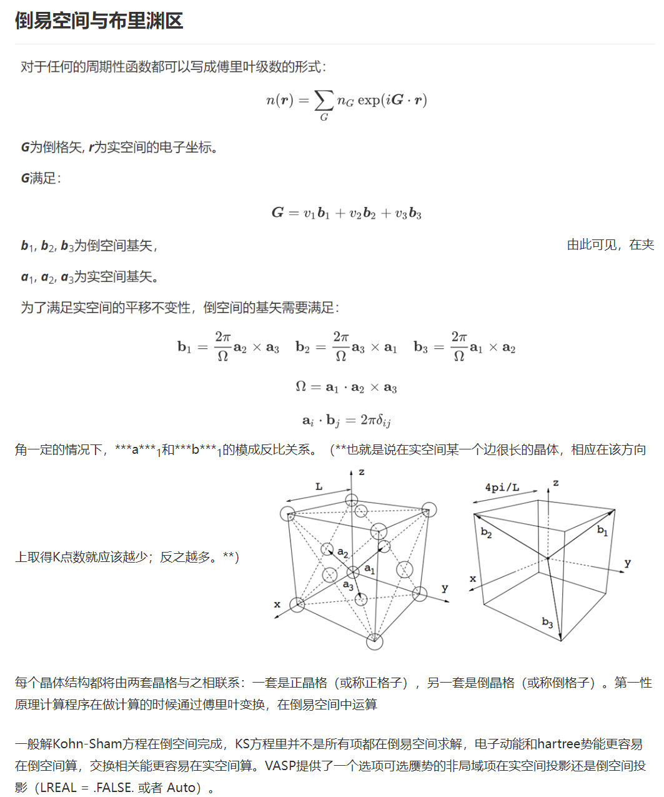
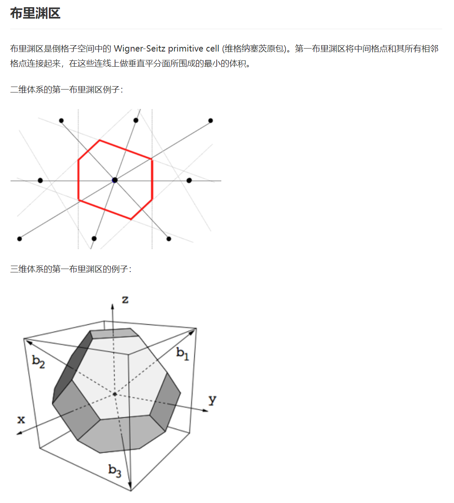
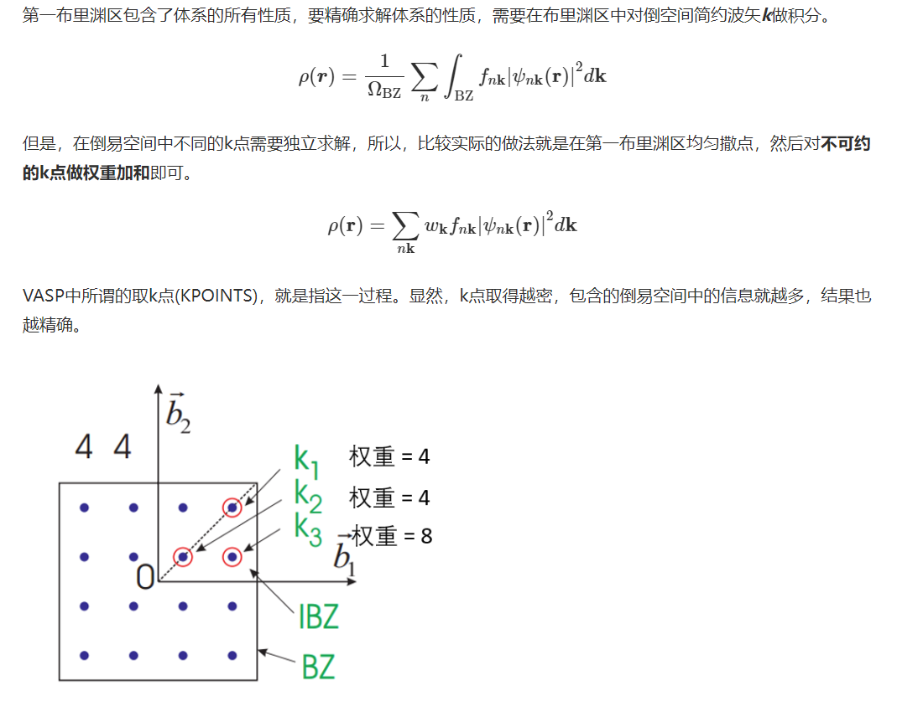

# KPOINTS 生成

K点是VASP计算中的关键参数，一般计算要在第一布里渊区均匀撒点，能带计算在高对称点连线路径上取值。K点的密度由KPOINTS决定，KPOINTS取点越多，包含到计算里的信息越多，计算结果就要准确。VASP提供的自动取K点的方法有两种：

>1. Monkhorst-Pack grids
>
>2. Gamma centered Monkhorst-Pack grids

INCAR里的K点只能设置每个K点之间的间距，不好直接指定K点的个数。二是数年来人们已经习惯了在KPOINTS里设定K点，一些VASP的插件有完善的生成KPOINTS的功能，用起来很方便。

在INCAR中设置K点是KGAMMA，和KSPACING这两个关键词，一般用不到，(因为用VASPKIT也可以做同样的事情)。KGAMMA是控制生成gamma中心K点，KSPACING是控制倒空间的K点和间隔距离，单位是Å-1。

## KPOINTS文件形式

```bash
Automatic mesh
0              ! number of k-points = 0 ->automatic generation scheme 
Gamma          ! generate a Gamma centered grid
4  4  4        ! subdivisions N_1, N_2 and N_3 along recipr. l. vectors
0. 0. 0.       ! optional shift of the mesh (s_1, s_2, s_3)
```

一共5行，需要改的只有第4行。

第一行，名字可以随便写，但是必须有

第二行，0代表VASP根据我们的要求自动产生K点

第三行，Gamma中心的Monkhorst-Pack grids

第四行，在倒格矢的三个方向上取K点的数目
1 1 1 # 1×1×1意思是在倒格矢a,b,c方向上都只取一个k点，一共1个k点。

3 3 1 # 3×3×1意思是在**倒格矢a,b方向上都取 3 个k点**，**c方向上取 1 个**，一共 9 个。

8 8 8 # 8×8×8，一共512个k点。

第五行，shift的值，Gamma center的K点就相当于MP方法shift了0.5 0.5 0.5

### 注意事项
> 1. 该KPOINTS 文件里面,共有5行, # 或 ！后面为注释。
> 
> 2. 第三行,VASP只认第一个字母g, 大小写均可。也可以写成Gamma，Google。这是> VASP关键词的一个特点，后面我们还会碰到好多关键词，只需要些首字母即可。
> 
> 3. 第四行，为生成对应数目的K点，建议使用VASPKIT生成。
> 
> 4. 第五行是，k点的shift值，一般不需要调，0 0 0即可。
> 
> 5. 对于原子或者分子的计算,K点取一个gamma点（1 1 1）就够了，多的K点是能提高周期性镜像分子间的相互作用精度，这部分能量是我们不想要的。即：对于含有真空层的体系，在真空层的方向上永远只使用一个K点。多余的K点只会增加真空层两边体系的相互作用的精度，而这一部分是我们不想要的。
> 
> 6. Gamma点在VASP计算中非常重要,建议是,永远用gamma centered,也就是第三行保持G不变。比如ISMEAR=-5或者六方晶系只能用Gamma center的方法，不能用MP。（有文献报道对于计算孤立缺陷体系用MP方法，不包含Gamma点可以减少defect-defect interaction）
> 
> 7. 在文章计算说明部分应该给出所使用的k点数量，因为如果不这样做，就很难对这些结果再现。
> 
> 8. 增大超晶胞的体积减少了达到收敛时所需要的k点数量，因为实空间体积的增加对应于倒易空间体积的减少。只含有一个gamma点的计算可以使用vasp_gam版加速计算。
> 
> 9. 如果计算中涉及不同体积的超晶胞，并需要对其结果进行比较，则在倒易空间中选定k点时，需要使不同超晶胞倒易空间中的k点密度大体相同，这是使这些计算在k空间中具有类似的收敛精度的有效方法。说白了，a×ka ≈ b×kb ≈ c×kc，或者让VASPKIT均匀撒点。


## 倒易空间与布里渊区







