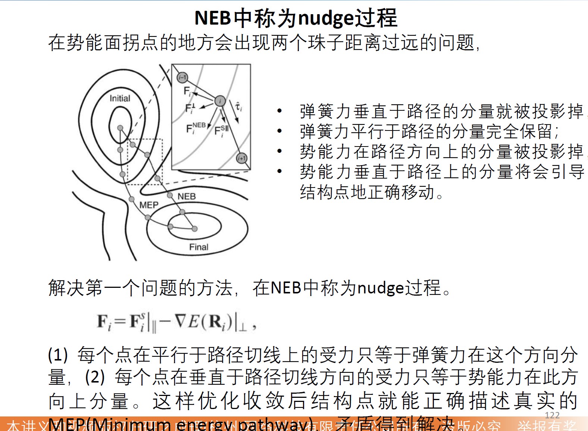
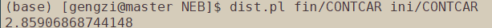
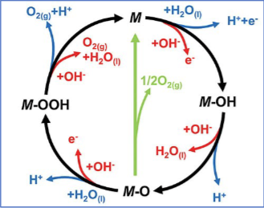

# 过渡态搜索的方法

根据方法所需要的初猜不同，可以分为以下几类：

（1）基于**单个初猜结构**的方法，（DIMER）

（2）基于**反应物**与**产物**结构的方法，（CI-NEB）

（3）基于反应物结构的方法，

（4）势能面扫描

VASP (VTST)支持最好的两种：DIMER，CI-NEB

# NEB （Nudged Elastic Band）基本原理
NEB 是chain- of -states 搜索方法中的一种，最好用的是CI-NEB（Climbing Image- NEB）

理论方法：
在反应物到产物之间插入一系列结构，共插入P-1个，反应物编号为0，产物编号为P。不同的是，优化不是对每一个点孤立的进行优化，而是优化每一个函数，每一步所有的点一起运动。




## NEB缺点

以上过程讲述的是VASP原版中使用的NEB。但是此方法仍有很多致命的缺点：

(1) 要插入足够多的点才可能找到近似的过渡态，计算资源消耗极大。

(2) 因为珠子不可能到鞍点的顶端，计算出的过渡态能量总是被低估的，又因为本来LDA，GGA泛函就经常低估过渡态
能量，所以误差叠加，此方法不太准确。

>❕**注意: **在网上看到一些说法CI-NEB插点越多越好，这是错误的结论！！由于能量最高的点可以自动爬坡，所以有的时候插一个点也可以精确的找到过渡态的位置，大多数时候插3到4个点已经完全能应付正常的过渡态计算需要.

## 步骤
```
neb/
├── is/       # 初态目录，包含优化好的CONTCAR
├── fs/       # 末态目录，包含优化好的CONTCAR
└── run/      # NEB计算主目录
```

### 1. 检查初始结构

运行命令dist.pl ini/CONTCAR fin/CONTCAR，检查两个结构的相似程度。一般情况下**小于5A**可以继续往下。


### 2. 准备好初末构型的vasp文件: is.vasp，fs.vasp，以及脚本：nebmake.pl

```nebmake.pl is.vasp fs.vasp 8```

末尾的8代表生成8个image，也代表插入点数。如果运行成功，会在当前文件夹**生成编号为00-09的十个文件**夹，每个文件夹包含一个POSCAR。**编号00和09的文件夹对应is.vasp和fs.vasp。**

之后把配置文件INCAR，KPOINTS，POTCAR放到当前文件夹。INCAR文件需要有以下字段：
IMAGES=8
LCLIMB = .TRUE.
IMAGES代表有8个image，LCLIMB是是否开启climbing image

### 3. 修改INCAR
```
# 基本设置
SYSTEM = NEB计算
ISTART = 1           # 从头开始计算
ICHARG = 1           # 从原子电荷密度开始
LWAVE = .TRUE.       # 保存波函数
LCHARG = .TRUE.      # 保存电荷密度
LVTOT = .FALSE.
LVHAR = .FALSE.
LELF = .FALSE.

# 电子结构收敛参数  
ENCUT = 400          # 能量截断，与结构优化相同或更高
ISMEAR = 0           # 高斯展宽
SIGMA = 0.2         # 展宽参数
EDIFF = 1E-7         # 电子步收敛标准，必须很严格!
NELMIN = 5           # 最小电子步
NELM = 300           # 最大电子步
PREC = Accurate      # 高精度计算

# 结构优化参数
EDIFFG = -0.03       # 离子步收敛标准，可适当放宽，对于非常复杂难以瘦脸的体系，可以放宽到-0.05
NSW = 500            # 最大结构优化步数
ISIF = 2             # 只优化原子位置，不优化晶胞
IBRION = 3           # VTST优化算法标识
POTIM = 0            # 不使用VASP内置的优化步长

# NEB具体参数 VTST
ICHAIN = 0           # 启用VTST中NEB方法
LCLIMB = .TRUE.      # 启用Climbing Image方法
IMAGES = 8           # 插点数量，与前面生成的一致，这里的8需要被替换
SPRING = -5          # 弹簧常数，-5为推荐值
IOPT = 1             # 优化算法选择(1=LBFGS, 2=CG, 7=FIRE等)  

# 其他可选参数
NCORE = 4            # 并行设置
KPAR = 2             # k点并行
GGA = PE             # 泛函类型
```

### 关键参数说明：

EDIFF=1E-7: 力的精确计算需要非常严格的电子步收敛

IBRION=3, POTIM=0: VTST识别并启动VTST优化算法的标志

ICHAIN=0: 启用NEB方法

LCLIMB=.TRUE.: 启用Climbing Image方法，将寻找精确的鞍点

IOPT=1: 使用LBFGS优化器，也可根据体系特点选择2(CG)或7(FIRE)


### 2. 监控计算进程
可使用VTST工具检查计算收敛情况：
```
bashCopynebef.pl      # 查看各图像的能量和力
```
在计算过程中，可以查看每个结构文件夹中的OUTCAR来检查原子受力情况。

### 检查是否收敛
```
grep "F=" */OUTCAR    # 检查每个镜像点的能量
grep "reached required accuracy" */OUTCAR  # 检查收敛情况
nebef.pl             # 查看每个图像的最大受力
```
收敛的计算应显示所有镜像点的最大原子受力均小于EDIFFG设定值

### 综合分析结构

```
nebresults.pl        # 自动处理NEB结果
```
这个命令会：

- 解压所有OUTCAR文件
- 运行nebbarrier.pl和nebspline.pl分析能量剖面
- 运行nebef.pl显示每个图像的力和能量
- 运行nebmovie.pl生成可视化文件
- 再次压缩OUTCAR文件节省空间


## 五、常见问题和解决方案
### 1. 计算不收敛或能量异常

问题：中间点能量低于初末态

解决：初态和末态可能还需进一步优化或使用IDPP方法生成更合理的初始路径

### 2. 过大的原子力

```bash
grep RMS */OUTCAR
```
问题：某些镜像点原子受力极大(>10 eV/Å)

解决：使用IDPP方法重新生成初始路径，避免原子过近

### 3. 多个鞍点或不合理路径

问题：能量曲线上出现多个峰

解决：增加镜像点数量或使用手动调整的初始路径

### 4. 缺少过渡态或能量曲线异常

问题：无法找到明确的过渡态或能量曲线不合理

解决：

- 检查初末态结构是否正确

- 尝试不同的插点方法(IDPP)

- 调整SPRING值

- 考虑增加镜像点


## 台阶图计算流程

### 1. 确定基元反应步骤
我们以 OER 反应机理研究为例进行说明。

首先我们知道 OER 反应的总反应方程式为：$2H_2O = 2H_2 + O_2$，然而反应并不是一步完成的，OER 的分步反应是怎样的呢？通过阅读资料找到 OER 反应的分步示意图。



因此 OER 反应的分步反应方程式可以写为以下形式：
$$(1)~ H_2O_{(l)} + * \rightarrow OH^* +H^+ /e^- $$
$$(2)~ OH^* \rightarrow O* +H^+/e^-$$
$$(3)~ O^* + H_2O{(l)} \rightarrow OOH^* +H^+/e^-$$
$$(4)~ OOH^* \rightarrow O_2{(g)} +* +H^+/e^-$$

分步反应是我们后续计算的基础，因此地基一定要打好，否则就是在做无用功。

### 2. 搭建用于计算的结构模型

为了计算台阶图，我们需要将分步反应中出现的各个中间态模型都搭建出来(H2O；*；OH*;O*;OOH*;O2)，吸附模型搭建的另一种注意事项：分子的吸附方法。针对反应第一步 O2 的吸附模型，会有如下三种吸附可能，因此在搭建模型时我们需要将可能不同的吸附模式都搭建出来(在计算完成后获取最佳吸附结构和最佳反应步骤)。对于吸附模式有哪些，我们也需要根据不同的吸附分子进行判断。

### 3. DFT 计算获取结构能量

在吸附结构搭建完成之后就可以利用 DFT 进行计算了，首先需要进行结构优化确定吸附结构的稳定构型，之后利用静态计算得到体系的能量，之后针对吸附分子我们再利用频率计算对吸附分子做自由能矫正。