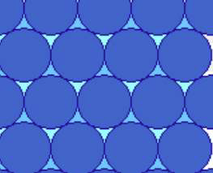

# NEB （Nudged Elastic Band）
NEB 是chain- of -states 搜索方法中的一种，最好用的是CI-NEB（Climbing Image- NEB）

理论方法：
在反应物到产物之间插入一系列结构，共插入P-1个，反应物编号为0，产物编号为P。不同的是，优化不是对每一个点孤立的进行优化，而是优化每一个函数，每一步所有的点一起运动。

## NEB缺点

1. 要插入足够多的点才可能找到过渡态，计算资源消耗大
2. 有可能出现两个最高点不在最大值的位置，而在两侧，计算出的过渡态的能量总是被低估，因为本来LDA，GGA泛函就经常低估过渡态能量，所以误差会叠加，此方法会不太准确。

## 步骤
1. 优化初态和末态结构，优化好的结构放入00，0x文件夹
2. 修改INCAR
