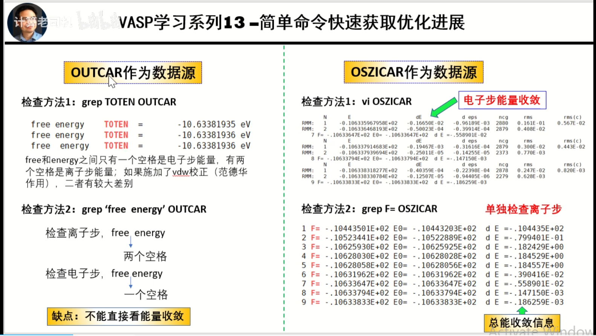

# 超算任务提交脚本

### 普通任务提交方法
```bash
#!/bin/bash
#SBATCH -J vasp-job
#SBATCH -o /home/mmagroup/torjohn528/PbO2-cata/Ce-PbO2/%j.out
#SBATCH -e /home/mmagroup/torjohn528/PbO2-cata/Ce-PbO2/%j.err
#SBATCH -p CPU-64C256GB --qos=qos_cpu_64c256gb
#SBATCH -N 1 
#SBATCH -n 32
#SBATCH --ntasks-per-node=32
echo Time is `date`
echo Directory is $PWD
echo This job runs on the following nodes:
echo $SLURM_JOB_NODELIST
echo This job has allocated $SLURM_JOB_CPUS_PER_NODE cpu cores.

# 切换到工作目录
cd /home/mmagroup/torjohn528/PbO2-cata/PbO2-211/

# 加载VASP模块
module load vasp/6.3.2/oneapi_2022.1.0

# 设置环境变量
export OMP_NUM_THREADS=1

# 运行VASP
mpirun -np $SLURM_NTASKS vasp_std > vasp.log
```
### vtst vaspsol提交脚本
```bash
#!/bin/sh
#An example for MPI job.
#SBATCH -J job_name
#SBATCH -o job-%j.log
#SBATCH -e job-%j.err
#SBATCH -p CPU-64C256GB --qos=qos_cpu_64c256gb
#SBATCH -N 2 -n 8

echo Time is `date`
echo Directory is $PWD
echo This job runs on the following nodes:
echo $SLURM_JOB_NODELIST
echo This job has allocated $SLURM_JOB_CPUS_PER_NODE cpu cores.
. /etc/profile.d/modules.sh
module load mpi/2021.6.0
MPIRUN=mpirun #Intel mpi and Open MPI

export PATH=/home/mmagroup/torjohn528/apps/vasp.6.3.2/bin:$PATH
module load vasp/6.3.2/oneapi_2022.1.0


$MPIRUN $MPIOPT vasp_std_vtst_sol 
```


# 获取结果指令

## 结构优化



