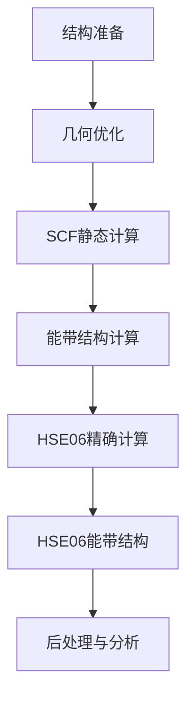

# 态密度及能带计算

## 态密度

### 计算流程总览



### 🧱 阶段详解

#### 🔸 阶段1：结构准备

* CIF → POSCAR（使用 VESTA）
* 检查真空层 ≥ 20 Å
* 使用 VASPKIT 或手动拼接生成 `POTCAR`

#### 🔸 阶段2：几何优化（PBE-D3）

* `INCAR` 关键参数：
  ```bash
  IBRION = 2, NSW = 200, EDIFFG = -0.02
  IVDW = 12 （Grimme D3 色散修正）
  ENCUT = 500, ISMEAR = 0, SIGMA = 0.05
  ```
* 使用中等密度 KPOINTS（如 `5x5x1`）
* 提交 SLURM 脚本运行

#### 🔸 阶段3：SCF 静态计算

* 使用优化后 `CONTCAR → POSCAR`
* `INCAR` 关键参数：
  ```bash
  IBRION = -1, NSW = 0, IVDW = 11, ISMEAR = 0
  LORBIT = 11（输出投影态密度）, NEDOS = 2001
  ```
* 使用更密集的 KPOINTS（如 `9x9x1`）
* 提交作业，输出 `CHGCAR`、`DOSCAR`

> ✅ 态密度分析可直接使用 VASPKIT 选项 10x 或 171

---

#### 🔸 阶段4：PBE 能带结构计算

##### ⚙ 非自洽计算设置：

* `ICHARG = 11`（读取 SCF 的 `CHGCAR`）
* 使用线性模式 KPOINTS（高对称路径）

```bash
KPOINTS 文件示例 (Line-mode):
GAMMA → X → M → GAMMA
每段40个点
```

##### 📌 INCAR 关键参数：

```bash
IBRION = -1, NSW = 0, ICHARG = 11, LORBIT = 11
```

---

#### 🔸 阶段5-6：HSE06 精确计算与能带结构（可选）

* 适用于更精确的能隙计算
* `LHFCALC = .TRUE., AEXX = 0.25, HFSCREEN = 0.2`
* 建议使用较稀疏的 KPOINTS（如 `5x5x1`）
* 作业时间与内存需求较大，需合理调度

##### HSE06精确计算

```bash
# 基本设置
PREC = Accurate
ENCUT = 500
EDIFF = 1E-5 # SCF收敛标准
NELM = 100 # HSE可能需要更多迭代
LREAL = .FALSE.
ALGO = Damped # 或All，适合HSE# 
TIME = 0.4 # VASP 6的时间步设置

# 静态计算
IBRION = -1
NSW = 0

# 电子结构设置
ISMEAR = 0
SIGMA = 0.05

# HSE06混合泛函
LHFCALC = .TRUE. # 启用Hartree-Fock
HFSCREEN = 0.2 # HSE06屏蔽参数
GGA = PE # PBE部分
AEXX = 0.25 # 精确交换比例(25%)
PRECFOCK = Fast # 或Normal(更精确但更慢)

# 色散修正
IVDW = 11

# 输出控制
LWAVE = .TRUE.LCHARG = .TRUE.
```

##### HSE06能带计算

```bash
# 基本设置
PREC = Accurate
ENCUT = 500
EDIFF = 1E-6
NELM = 100
LREAL = .FALSE.
ALGO = Exact # 适合能带计算

# 非自洽计算
IBRION = -1
NSW = 0
ICHARG = 11 # 读取HSE06的CHGCAR

# 电子结构设置
ISMEAR = 0
SIGMA = 0.05 # HSE06混合泛函
LHFCALC = .TRUE.
HFSCREEN = 0.2
GGA = PE # PBE部分
AEXX = 0.25 # 精确交换比例(25%)
PRECFOCK = Fast 

# 色散修正
IVDW = 12 # DFT-D3色散矫正

# 输出控制
LWAVE = .TRUE.
LCHARG = .FALSE.
LORBIT = 11
```


---

### 🧪 后处理分析（使用 VASPKIT）

#### 能带提取与绘图步骤：

```bash
# 提取能带数据
vaspkit → 211（能带提取）
vaspkit → 281（能带隙分析）

# 关键文件：
BAND.dat （能带数据）
KLABELS （高对称点标签）

# Python绘图示例已包含 plot_bands.py
```

#### 态密度提取：

```bash
vaspkit → 171（总态密度）
vaspkit → 172（投影态密度）
```

---

### 📈 能级分析

* **VBM (HOMO)** 与 **CBM (LUMO)** 信息可由 VASPKIT 自动分析提供
* 可用 `grep "E-fermi"` 提取 Fermi 能级
* 能隙公式：
* $E_{g} = E_{CBM} - E_{VBM}$

---

### 💡 计算建议与资源分配

| 计算阶段  | 核心数 | 时间 | 内存         |
| --------- | ------ | ---- | ------------ |
| 几何优化  | 32     | 24h  | 2–4 GB/core |
| SCF计算   | 32     | 12h  | 2–4 GB/core |
| PBE能带   | 32     | 6h   | 2–4 GB/core |
| HSE06-SCF | 64     | 72h  | 4–8 GB/core |
| HSE06能带 | 64     | 48h  | 4–8 GB/core |

---

### ❓ 常见问题解决

* **SCF不收敛**：增加 `NELM`, 改 `ALGO=All`
* **HSE失败**：增加 `PRECFOCK=Normal`, 提高内存
* **收敛慢**：调 `POTIM` 和 `EDIFFG`

---

### ✅ 总结

* 使用 **PBE-D3** 进行结构优化和快速能带扫描
* 使用 **HSE06-D3** 得到更准确的能隙
* **VASPKIT** 是后处理利器，可快速分析和绘图
* 合理分配计算资源，避免冗余作业
