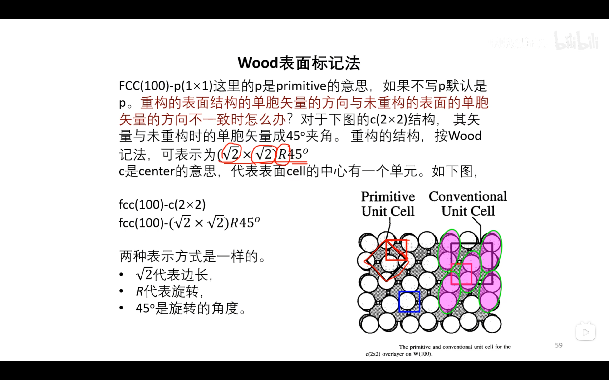
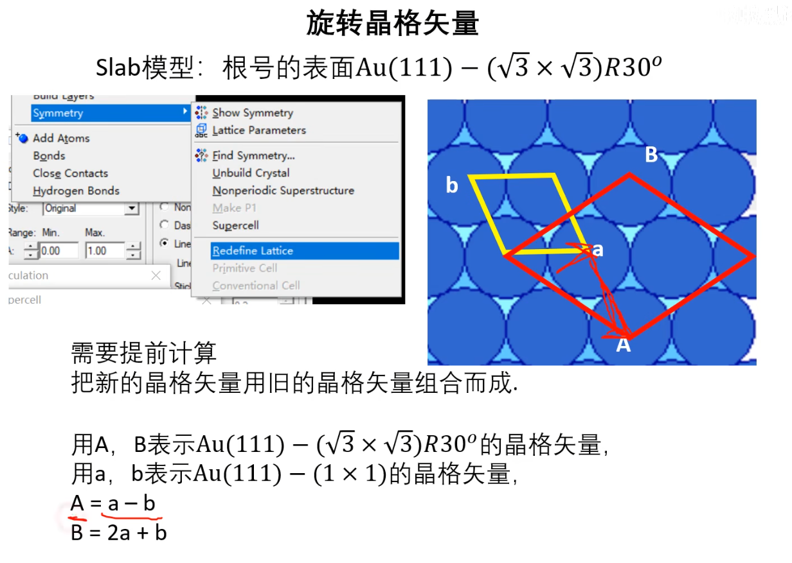
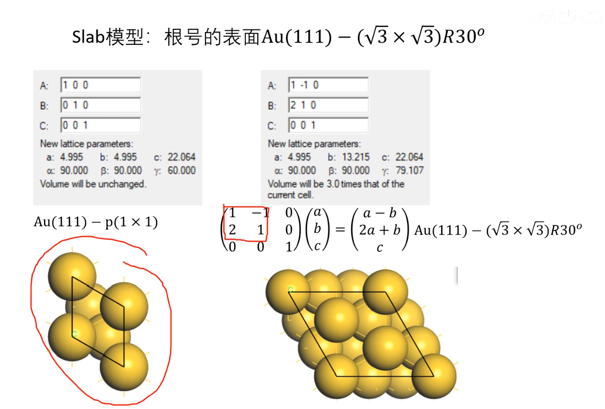

## 根号表面的建立

### Wood表面标记法
FCC(100)-p(1x1)这里p是primitive(最小的重复单元)，超晶胞就标记为(2x2),(3x3)。

重构的表面结构的单胞矢量方向与未重构的表面的单胞矢量方向不一致怎么办？

fcc(100)-c(2x2)=fcc(100)-(√2x√2)R45° （R代表旋转）

### 旋转晶格矢量

### 切表面要切多厚？

怎样定义thickness？

什么是原子层，什么是原子双层？

要做层厚的收敛性测试：对应的表面能是多少，到某一层之后表面能变化就会很小了。

### 超胞多大合适？

为什么要设置超胞？

不希望看到左右、镜像之间的相互作用（真实体系不存在这种相互作用）

拉大晶格==超胞，LengthA超过10Å则可认为合适了

考虑多种吸附位点的吸附构想

### 晶格失配率

