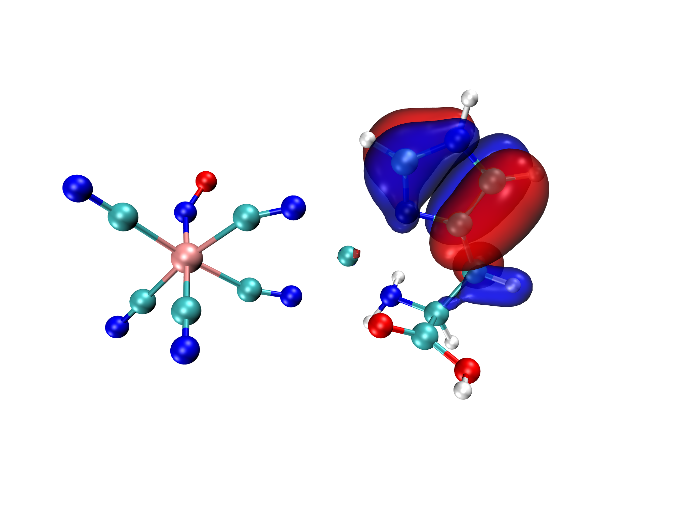

# 使用Multiwfn与VMD联合渲染高质量分子轨道可视化图像

## 1. 引言

本研究介绍了一种基于Multiwfn与VMD软件联合应用的高效分子轨道可视化方法。先前的研究《使用Multiwfn观看分子轨道》（[http://sobereva.com/269](http://sobereva.com/269)）详细介绍了Multiwfn在轨道等值面图、曲线图和平面图的绘制功能，以及将轨道波函数格点数据导出为cube文件并使用VMD进行可视化的方法。本文进一步优化了这一工作流程，通过引入自动化脚本显著提高了效率。

相对于传统的GaussView分子轨道可视化方法，本方法具有显著优势：

1. 计算资源需求低，特别适用于大型分子体系（效率提升可达两个数量级）
2. 渲染质量显著提升，可产生出版级图像质量
3. 全部基于开源免费软件，无需额外许可证费用

## 2. 材料与方法

### 2.1 软件要求

本研究基于以下软件实现：

- **Multiwfn**：用于波函数分析与处理（官方网站：[http://sobereva.com/multiwfn](http://sobereva.com/multiwfn)）
- **VMD (Visual Molecular Dynamics)**：版本1.9.3（官方网站：[http://www.ks.uiuc.edu/Research/vmd/](http://www.ks.uiuc.edu/Research/vmd/)）

### 2.2 兼容文件格式

本方法可处理多种量子化学计算软件生成的输出文件，包括：

- Gaussian：.fch/.fchk格式文件
- ORCA、Q-Chem、GAMESS-US、Firefly等：.molden格式文件
- Multiwfn专有格式：.mwfn文件

关于更多支持的输入文件类型详细信息，请参考《详谈Multiwfn支持的输入文件类型、产生方法以及相互转换》（[http://sobereva.com/379](http://sobereva.com/379)）。

本方法已在Windows系统上进行了测试，亦可在Linux环境中通过类似配置实现。

### 2.3 工作流程配置

本研究采用以下步骤进行自动化配置：

1. 将Multiwfn发行包中的 `examples\scripts`目录下的 `showorb.bat`和 `showorb.txt`文件复制到Multiwfn可执行文件所在目录（复制一次后，今后所有的操作均可在vmd文件夹下完成）
2. 编辑 `showorb.bat`批处理文件：

   - 修改输入文件名（默认为"1.fch"）
   - 更新VMD的安装路径（含空格的路径需添加双引号，不需要精确到 `.exe` 文件）
3. 编辑 `showorb.txt`脚本文件：

   - 在**第三行**指定需要绘制的轨道序号范围（如：`10,20-23,28-30`）
   - 注意这里如果是α和β分裂轨道，应该参照 **4.1 非限制性波函数的β轨道处理**
4. 配置VMD环境：

   - 将 `examples\scripts`目录下的 `showorb.vmd`脚本文件复制到VMD安装目录
   - 编辑VMD目录下的 `vmd.rc`文件，在文件末尾添加：`source showorb.vmd`

VMD脚本配置后提供三个关键命令：

- `orb [序号]`：加载并显示指定轨道的等值面（默认等值为0.05）
- `orbiso [值]`：修改当前显示轨道的等值面值（例如：`orbiso 0.02`）
- `orbclean`：清除VMD目录下所有生成的轨道数据文件

### 2.4 处理流程

完成配置后，处理流程如下：

1. 运行 `showorb.bat`脚本，该脚本将：

   - 调用Multiwfn加载指定的波函数文件
   - 计算指定轨道的三维格点数据
   - 生成标准化格式的cube文件（如：orb000020.cub）
   - 自动将所有生成的cube文件移动至VMD安装目录
2. 启动VMD程序，使用命令行窗口输入 `orb [序号]`命令进行轨道可视化
3. 根据需要使用 `orbiso`命令调整轨道等值面参数
4. 完成可视化后，可选择性使用 `orbclean`命令清理临时文件

## 3. 实验结果

### 3.1 基准测试案例

本研究以NH₂-biphenyl-NO₂共轭分子体系为例进行方法验证。以下为操作流程：

1. 将Multiwfn示例文件 `examples\excit\D-pi-A.fchk`复制到Multiwfn工作目录并重命名为"1.fch"
2. 当不知道HOMO-LUMO轨道时，先在Multiwfn中输入0，查看轨道数

   ```bash
    Range of alpha orbitals:    1 -  857      Range of beta orbitals:  858 - 1714
    Note: Orbital   110 is alpha-HOMO, energy:   -0.264820 a.u.   -7.206120 eV
          Orbital   964 is beta-HOMO, energy:    -0.264981 a.u.   -7.210487 eV
          Orbital   111 is alpha-LUMO, energy:   -0.157332 a.u.   -4.281213 eV
          Orbital   965 is beta-LUMO, energy:    -0.182057 a.u.   -4.954010 eV
          HOMO-LUMO gap of alpha orbitals:    0.107488 a.u.    2.924907 eV
          HOMO-LUMO gap of beta orbitals:     0.082924 a.u.    2.256476 eV
   ```
3. 修改 `showorb.txt`文件，设置轨道序号范围为54-59（对应HOMO-2至LUMO+2）
4. 执行 `showorb.bat`脚本生成轨道数据
5. 启动VMD，输入 `orb 56`命令查看HOMO轨道

### 3.2 可视化结果

图1展示了通过本方法生成的NH₂-biphenyl-NO₂分子HOMO轨道的等值面图。图中轨道波函数的正相位区域以红色表示，负相位区域以蓝色表示。



可视化操作简便灵活：

- 使用 `orb 57`命令可迅速切换至LUMO轨道
- 使用 `orbiso 0.02`命令可调整等值面值以观察更精细的轨道细节
- 使用 `orbclean`命令清理生成的临时文件

## 4. 高级参数与优化

### 4.1 非限制性波函数的β轨道处理

对于非限制性开壳层波函数，Multiwfn中的β轨道编号排列在α轨道之后。若系统包含x个基函数，则第1号β轨道在Multiwfn中的序号为x+1。在配置 `showorb.txt`文件时需注意这一点。

可通过以下方法确定β轨道的Multiwfn序号：

- 在Multiwfn主功能0界面输入 `-n`（如 `-30`）查看第n号β轨道的序号
- 通过界面左上角 `Orbital info.`选项输出所有轨道信息

```bash
 Range of alpha orbitals:    1 -  269      Range of beta orbitals:  270 -  538
 Note: Orbital   100 is alpha-HOMO, energy:   -0.268555 a.u.   -7.307740 eV
       Orbital   366 is beta-HOMO, energy:    -0.268755 a.u.   -7.313205 eV
       Orbital   101 is alpha-LUMO, energy:   -0.160082 a.u.   -4.356062 eV
       Orbital   367 is beta-LUMO, energy:    -0.170577 a.u.   -4.641647 eV
       HOMO-LUMO gap of alpha orbitals:    0.108472 a.u.    2.951678 eV
       HOMO-LUMO gap of beta orbitals:     0.098178 a.u.    2.671558 eV
```

### 4.2 高级渲染选项

#### 4.2.1 原子标签显示

VMD 1.9.3版本不提供内置的原子序号显示功能，但可通过专用脚本实现。详细方法参见《在VMD中显示原子序号的方法》（[http://sobereva.com/197](http://sobereva.com/197)）。

#### 4.2.2 高质量渲染

为获得出版级质量图像，建议使用Tachyon渲染引擎，其优势包括：

- 提供高质量的材质效果
- 支持抗锯齿处理
- 可生成高分辨率图像
- 

Tachyon渲染器的详细使用方法可参考《用Multiwfn+VMD做RDG分析时的一些要点和常见问题》（[http://sobereva.com/291](http://sobereva.com/291)）。

#### 4.2.3 材质与颜色优化

可通过以下方法自定义轨道等值面的视觉效果：

1. 材质调整：

   - 默认使用Glossy材质
   - 对于透明效果，建议使用**EdgyGlass**或Translucent材质
   - 可通过VMD图形界面（Graphics - Representation - Material）或编辑showorb.vmd脚本进行修改
2. 颜色设置：

   - 默认配置：红色表示正相位，蓝色表示负相位
   - 可通过VMD界面的Color ID设置或编辑showorb.vmd文件修改颜色方案

### 4.3 计算参数调整

#### 4.3.1 网格质量优化

本方法默认使用中等质量格点（约512,000个网格点）进行计算。针对不同体系，可采取以下调整：

- 对于原子数超过100的大型分子体系：建议使用高质量格点以避免等值面出现棱角，具体操作为修改 `showorb.txt`第四行的值从"2"改为"3"
- 对于里德堡轨道（Rydberg orbitals）：由于空间延展较大，建议增加计算边界，具体操作为在 `showorb.txt`的第三行和第四行之间插入：

  ```
  -10
  12
  ```

  此设置将边界延展至12 Bohr，适用于大多数体系

#### 4.3.2 多轨道分批处理

如需分批处理不同轨道组，可采用以下流程：

1. 首先配置 `showorb.txt`计算轨道组A（如：20-30号轨道）
2. 执行 `showorb.bat`完成第一批轨道计算
3. 修改 `showorb.txt`配置轨道组B（如：35-40号轨道）
4. 再次执行 `showorb.bat`
5. 轨道组A和B的数据文件将同时存在于VMD目录，可随时通过 `orb`命令查看任意轨道

## 5. 常见问题与解决方案

以下为使用过程中可能遇到的常见问题及其解决方案：

### 5.1 轨道文件加载错误

当执行 `orb 23`命令出现"Could not read file orb000023.cub"错误时，可能的原因包括：

1. VMD目录文件问题：

   - `showorb.bat`中VMD路径配置错误
   - 包含空格的路径未使用双引号
   - 文件系统权限问题阻止文件复制至VMD目录
2. 输入文件问题：

   - 输入文件格式不兼容或文件损坏
   - `showorb.bat`中的输入文件路径错误
   - `showorb.txt`中未包含需查看的轨道序号
3. 软件配置问题：

   - VMD版本兼容性问题（建议使用VMD 1.9.3版本）

### 5.2 VMD命令未识别

当执行 `orb`命令出现"invalid command name 'orb'"错误时，可能的原因包括：

1. VMD配置文件问题：

   - `vmd.rc`文件中未添加 `source showorb.vmd`命令
   - 配置文件修改后未保存或未重启VMD
2. 脚本文件问题：

   - `showorb.vmd`文件未正确放置在VMD安装目录

## 6. 结论

本研究提出的Multiwfn与VMD联合轨道可视化方法具有显著优势：

1. 大幅提高了计算效率，特别是对于大型分子体系
2. 提供了高度灵活的可视化参数控制
3. 支持多种量子化学计算格式，适用范围广
4. 可生成具有科研出版质量的分子轨道图像

该方法通过脚本自动化流程，使分子轨道可视化过程变得高效、标准化和可重复，为量子化学研究提供了强大的可视化工具。

## 参考文献

1. 《使用Multiwfn观看分子轨道》, [http://sobereva.com/269](http://sobereva.com/269)
2. 《详谈Multiwfn支持的输入文件类型、产生方法以及相互转换》, [http://sobereva.com/379](http://sobereva.com/379)
3. 《图解电子激发的分类》, [http://sobereva.com/284](http://sobereva.com/284)
4. 《用Multiwfn+VMD做RDG分析时的一些要点和常见问题》, [http://sobereva.com/291](http://sobereva.com/291)

## 致谢

若使用本方法进行分子轨道可视化，请按Multiwfn程序要求引用相关文献。
