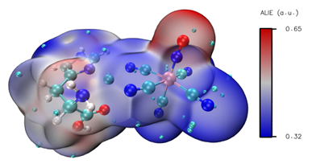

# 平均局部离子化能

> Can.J.Chem.,68,1440 (1990)
>
> [使用Multiwfn的定量分子表面分析功能预测反应位点、分析分子间相互作用 - 思想家公社的门口：量子化学·分子模拟·二次元](http://sobereva.com/159)

$$
ALIE(r)=∑[i]ρ_i(r)*|ε_i|/ρ(r)
$$

其中ρ_i(r)是r处第i个分子轨道的电子密度，|ε_i|是第i个分子轨道能量的绝对值，可以视为i轨道的电子的离子化能，ρ(r)是r处总电子密度。r处ALIE值越小，代表在此处的电子平均能量越高，被束缚得越弱。

ALIE有很多应用，比如衡量电负性、表征局部极化率、预测pKa，展现原子壳层结构

在分子表面上，ALIE越小处，由于电子束缚得越弱，或者说电子活性越强，就越容易发生亲电及自由基反应。通过定量分子表面分析算法，找出分子表面上ALIE最小的几个点，看这几个点离哪些原子比较近，就能判断哪些原子最可能是反应活性位点。ALIE的极小点容易出现在pi电子、孤对电子附近，因为这些区域的电子被束缚得较弱。可以认为ALIE越小处，局部极化率越大，这与密度泛函理论中的局部软度/硬度概念也是密切相关的。

## ALIE和静电势的关系

通过静电势和ALIE在预测反应位点上不仅不矛盾，反倒是互补的。单靠静电势很多情况都不能正确预测反应位点；而单靠ALIE，在一些情况下也是失败的（而且ALIE也不能用于预测亲核位点），此时必须将静电势综合考虑。

1. ***两个分子从相距很远逐渐接近***：这个过程中分子的电子分布并不发生明显改变，顶多是稍微被另一个分子的电场所极化。长程静电相互作用在这个过程中是关键，通过分析分子表面的静电势，可以很好地估计反应物容易被拉到哪里。也因此，光靠分析ALIE来预测反应位点往往不行，因为即便靠ALIE预测出某些原子容易发生反应，但是若反应物不容易靠静电作用被拉到这里，则在这里发生反应的几率还是不大。
2. ***范德华表面快要接触的两个分子进一步靠近，通过成键、断键这样的电子结构重排过程完成化学反应***：这一步在哪里容易进行，关键看哪个原子附近电子活性大，用ALIE最适合研究这个问题。这也表现出单纯靠静电势预测反应位点的不可靠性，因为比如某原子附近静电势越负，只能说明亲电试剂越容易被拉到这原子附近，却不代表这原子附近的电子越活泼因而越容易参与反应。再者，当分子间接近到快要反应时，分子的实际电子分布与它在孤立时的电子分布已有很大差异，前面介绍静电势时提到的“对分子的电荷分布不产生任何影响”的前提条件已经不能满足，所以用分子孤立状态的静电势已经不能很好说明问题。

## 操作流程

·将***examples\scripts***里的***ALIE.vmd***复制到VMD目录下
·将***examples\scripts***里的***ALIE_isoext.bat***和***ALIE_isoext.txt***复制到***Multiwfn.exe***所在目录下
·编辑***ALIE_isoext.bat***批处理文件，将里面的文件路径改成实际要考察的，把VMD路径也改成实际的。输入文件可以用.wfn、.fch、.molden等
·双击ALIE_isoext.bat，Multiwfn将被自动调用进行计算，算完后会在VMD目录下产生avglocion.cub、density.cub、surfanalysis.pdb
·启动VMD，在命令行窗口输入source ALIE.vmd，就可以得到想要的图像了

### Multiwfn+VMD中修改参数

1. 不知道体系的最大值和最小值时，在Multiwfn的ALIE_isoext.bat中的第一行末尾，加上 `[空格] <out.txt`，脚本调用Multiwfn期间输出的信息就会导出到当前目录下的out.txt，其中搜c:和Maximal value，手动将得到的值从eV换算为Hartree，作为色彩上限下限
2. 色彩的上下限调整：VMD命令行中输入：`mol scaleminmax 0 1 0.31 0.37`，这里0.31和0.37分别是色彩刻度下限和上限。也可以在 `Graphics - Representations-selected molecule-0：density.cub-Isosurface-Trajectory-Color Scale Data Range `进行修改

# 如何分析ALIE？

以下面的图为例：

红色的地方代表电子更难失去

蓝色的地方代表电子更容易失去

如果要进行羟基的氧化，OH基团上的O应该显示蓝色（容易失去电子）
