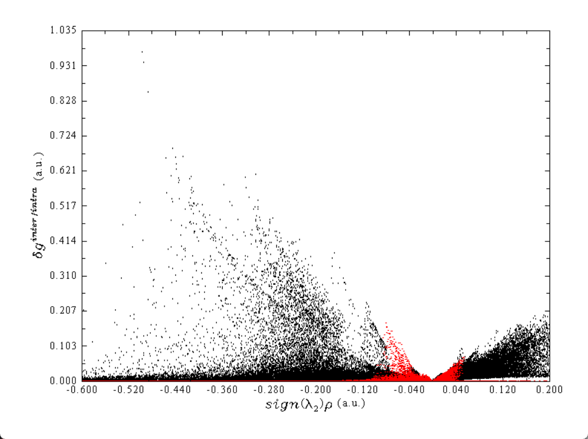

# 使用Multiwfn做IGMH分析非常清晰直观地展现化学体系中的相互作用

> **Visualization Analysis of Covalent and Noncovalent Interactions in Real Space**
>
> **Erratum to “Independent gradient model based on Hirshfeld partition: A new method for visual study of interactions in chemical systems”**

## 1. 基本原理

δg可以划分为用于展现片段内相互作用的δg_intra和展现片段间相互作用的δg_inter。在说这个之前，这里先把δg的比较严谨的数学定义给出来。下式中i是原子序号，▽ρ是梯度矢量，abs(▽ρ)代表对里面▽ρ矢量的每个分量都取绝对值（还是保持矢量形式），| |代表对矢量取模。

δg可以展现当前体系中所有原子间的相互作用。为了能专注于展现特定片段间（interfragment）和片段内（intrafragment）的相互作用，可分别定义δg_inter和δg_intra，如下所示。其中A循环用户定义的各个片段

λ2是电子密度Hessian矩阵第二大本征值，sign()是取符号的意思。相互作用区域里某个位置的λ2若小于0体现出在此处原子间有吸引作用，大于0则体现互斥作用（但这只是个对多数相互作用区域适用的粗糙的、经验性的判据，切勿教条化理解）。ρ是当前体系实际电子密度，在相互作用区域此值越大暗示相互作用越强。sign(λ2)和ρ相乘得到的sign(λ2)ρ显然有能力对相互作用类型和强度进行区分。在IGMH原文里笔者给出了下图，可以作为IGMH图中sign(λ2)ρ的标准着色方式，不同颜色对应的常规解释也都给出了

### IGMH和IGM的区别

IGM直接用原子在孤立状态下的球对称化的电子密度当做式中的ρ_i，分布仅由元素决定而不体现实际化学环境影响。这么做的好处是计算起来很快，在高效的Multiwfn中算几千个原子都能做到，而且只需要提供体系的坐标和元素信息就能做IGM分析，因为各种元素原子的球对称化的电子密度分布在Multiwfn程序中是直接内置的。但代价是，IGM的物理意义不严格，原子密度分布没有体现体系的实际电子结构，而且最关键的是，往往图像效果烂。

IGM图中δg和δg_inter函数的等值面往往特别肥厚，不仅丑陋，还经常延伸到距离原子核较近因而电子密度较大的位置，导致在根据弱相互作用区域sign(λ2)ρ的颜色判断时往往会高估作用强度。

IGMH使用Hirshfeld原子空间划分的方式从体系实际的电子密度中划分出各个原子的电子密度，由于考虑了实际电子结构和化学环境，从物理意义上就比IGM强。

IGMH分析中用的sign(λ2)ρ是基于实际电子密度计算的，而IGM分析中的sign(λ2)ρ是基于粗糙的准分子（promolecular）密度算的，准分子密度只是各个原子孤立状态电子密度的简单叠加，没有体现原子间相互作用对电子密度的改变。

由于IGMH要基于实际电子密度做分析，因此输入文件必须包含波函数信息，这需要做量子化学或第一性原理计算得到。

### 定量化分析原子和原子对对相互作用的贡献

原子对δg指数（atomic pair δg index）记为δG_pair，定义如下。其中A和B是要被考察相互作用的两个片段，i和j分别是两个片段中的原子。原子对的δG_pair(%)定义为它的δG_pair占两个片段间所有δG_pair总和的百分比，可以粗略体现原子对对片段间相互作用的贡献程度。

原子δg指数记为δG_atom，它可以衡量各个原子对片段间作用的贡献程度，其定义如下，其中i是一个片段里的原子，j循环另一个片段里的所有原子。相应地还可以定义δG_atom(%)用于衡量某原子对片段间作用贡献的百分比。

它们只适合粗略判断哪些原子和原子对较为重要、比较值得关注。

## 使用方法

在Multiwfn中做IGMH分析非常简单，通常就是以下步骤，这里简要提一下，具体细节看后文的例子

(1)启动Multiwfn，载入波函数文件，进入主功能20的子功能11

(2)输入片段总数，以及每个片段包含的原子序号

(3)设置格点。格点涵盖的范围要至少包含感兴趣的等值面出现的区域。格点间距越小，等值面会越平滑、图像效果越好，但计算耗时越高。关于设定格点的常识性知识看《Multiwfn FAQ》（[http://sobereva.com/452](http://sobereva.com/452)）里的Q39。

(4)Multiwfn开始对每个格点计算δg、δg_inter、δg_intra、sign(λ2)ρ这些函数。耗时和体系大小、基组大小、格点数、CPU性能有关。Multiwfn的这部分功能做了充分的并行化，计算量大的情况应当在较好服务器CPU上算，并且记得把settings.ini里的nthreads参数设为CPU实际物理核心数。

(5)计算完毕后出现了后处理菜单，之后：
• 如果要计算δG_pair、δG_atom等前面提到的指数，就选选项6，然后这些指数就会输出到屏幕上提示的文本文件里。还同时可以输出atmdg.pdb，在VMD里基于它就可以对原子着色来展示原子的δG_atom或δG_atom(%)值
• 如果要绘制IGMH等值面图，就选择选项3，将δg、δg_inter、δg_intra、sign(λ2)ρ函数的格点数据导出为各自的cub文件。之后结合Multiwfn文件包里提供的VMD作图脚本IGM_inter.vmd和IGM_intra.vmd就可以分别得到sign(λ2)ρ着色的δg_inter和δg_intra等值面图

δg_inter：主要显示的是最开始进行分段的几个分子片段间的相互作用

δg_intra：主要现实的是除了上述片段之外的，其他部分的相互作用

下图中的红色部分是δg_inter，黑色部分是δg_intra

| 区域                                      | ( sign(\lambda_2)\rho ) 范围 | 相互作用类型             | 说明                                         |
| ----------------------------------------- | ---------------------------- | ------------------------ | -------------------------------------------- |
| **左侧尖峰（≈ -0.05 到 -0.20）**   | 负值                         | **氢键/电荷转移**  | 常见于H键或金属-配体弱吸引                   |
| **靠近0的部分（≈ -0.02 ~ +0.02）** | 接近零                       | **范德华相互作用** | 弱、分散的相互作用，如π–π、C–H···π等 |
| **右侧（> +0.05）**                 | 正值                         | **排斥作用**       | 原子核间或共价键内部的排斥                   |

X轴：sign(λ2)ρ

> 负值(<0)  → 吸引相互作用（氢键、配位键）
> 正值(>0)  → 排斥相互作用（位阻）
> 接近0    → 范德华相互作用
>
> 一般体系：   -0.05 到 +0.05
> 强相互作用： -0.10 到 +0.05
> 弱相互作用： -0.03 到 +0.03

Y轴：delta-g值

> 高delta-g  → 强相互作用
> 低delta-g  → 弱相互作用
>
> 默认：0 到 1.0
> 聚焦强相互作用：0 到 0.5
> 看弱相互作用：0 到 2.0
>
> delta-g_inter等值面推荐值：
> 0.005  ← 非常弱相互作用（范德华）
> 0.010  ← 弱相互作用
> 0.020  ← 中等相互作用
> 0.030  ← 较强相互作用（氢键、配位）
> 0.050  ← 强相互作用

> Y (delta-g)
> ↑
> 强    |     ●  ← 强相互作用
> 相    |    ●●
> 互    |   ●●●
> 作    |  ●●●●●
> 用    | ●●●●●●●
> |●●●●●●●●●
> 0 └─────────────→ X (sign(λ2)ρ)
> 排斥  0  吸引
>
> 左侧尖峰 → 强吸引（氢键、配位键）
> 右侧 → 位阻排斥
> 中间平坦 → 范德华
